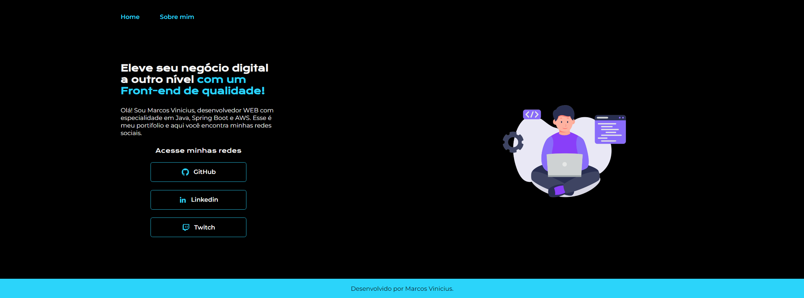

# Portfólio
Projeto da Formação Front-end da Alura.

### Live: https://devmarcosvinicius.github.io/portfolio-front-end-alura/

## Preview:

## Ferramentas utilizadas:
* HTML
* CSS
* Flex-box

## Feito por:
Marcos Vinicius
### Linkedin: https://linkedin.com/in/devmarcosvinicius